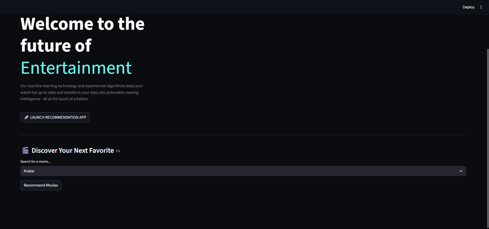
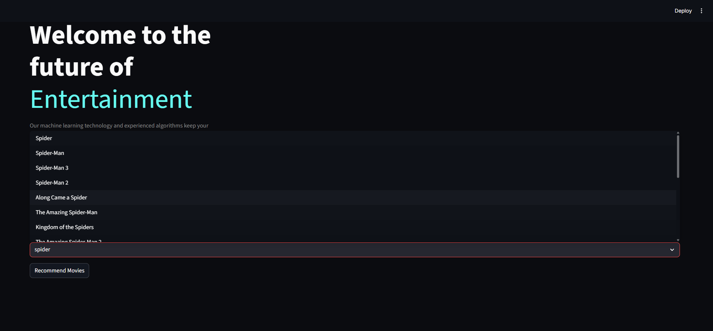

# Movie Recommendation System 🎬

[](https://www.python.org/) 
[](LICENSE)

A **context-based movie recommendation system** that suggests movies based on the content and attributes of the movies you like. Built with Python, this project demonstrates how to generate personalized recommendations using context-based filtering techniques.

---

## Features

- Recommends movies using **context-based filtering** only (no collaborative filtering).
- Analyzes movie attributes like **genres, cast, crew, keywords** for recommendations.
- Lightweight and easy to run locally.
- Can be extended to a web interface using Flask or Streamlit.

---

## Project Structure

magnetic-cluster/
├── app.py # Main app to run the recommendation system
├── dataprep.py # Data preprocessing scripts
├── data/ # Movie datasets
│ ├── tmdb_5000_movies.csv
│ └── tmdb_5000_credits.csv
├── models/ # Pickled model files (large, kept locally)
├── requirements.txt # Python dependencies
├── setup.sh # Optional setup script
├── .gitignore
└── README.md

## Screenshots






---

## Installation

1. Clone the repository:

```bash
git clone https://github.com/Shashvat183/movie_recommendation_system.git
cd movie_recommendation_system
Create a virtual environment:

python -m venv .venv


Activate the virtual environment:

Windows:

.\.venv\Scripts\activate


Mac/Linux:

source .venv/bin/activate


Install dependencies:

pip install -r requirements.txt

Usage

Run the main app:

python app.py


Follow the prompts to get movie recommendations.

Note: The .pkl model files (similarity.pkl, movie_dict.pkl) are not included in this repo due to GitHub file size limits.
You can generate them locally using dataprep.py or request them separatExample Recommendation

Replace the above image with a screenshot or GIF showing the system in action.

Technologies Used

Python 3

Pandas, NumPy

Scikit-learn

Flask / Streamlit (optional for web interface)

Author

Shashvat Sharma
Email: shashusharma145@gmail.com

